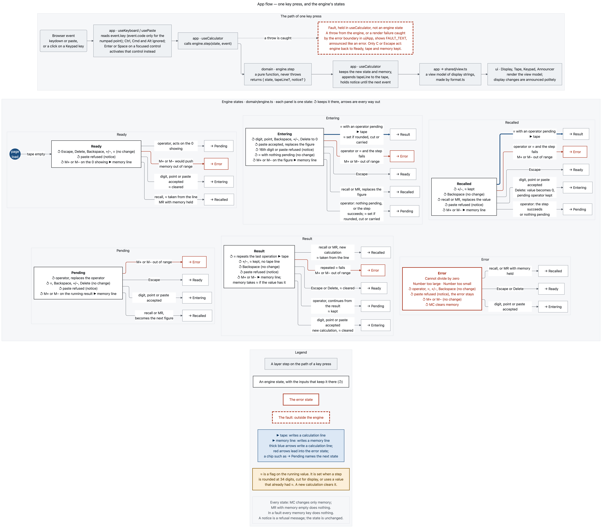
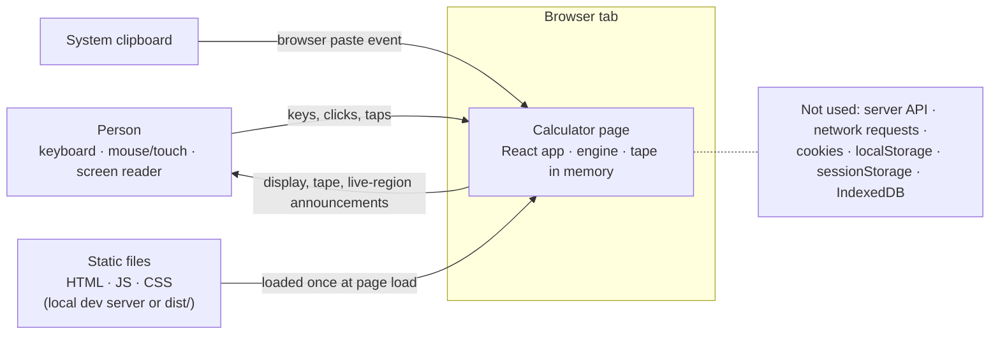
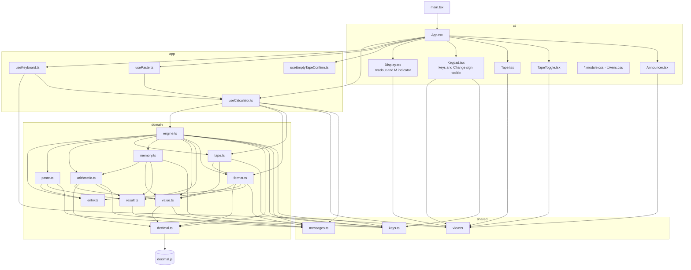

# Architecture

This document records decisions already made; it adds no behaviour. The behaviour itself is in the Decisions section of `CLAUDE.md` and in `user-stories.md`. ADRs for individual choices are in `docs/adr/`. Module names below are the planned layout. `src/` is empty until the first story is built.

## Flow diagrams

Three diagrams draw what this document and the stories already say. They are large, so open an image on its own to read it at full size. The Mermaid sources and the command that regenerates them are in `diagrams/`.

**User flow.** How each role moves through the calculator, including the refusal, error and fault paths.


**App flow.** The path of one key press from the browser event to the screen, then each engine state with every way out of it.



**Architecture flow.** The layers and their imports, decimal.js behind its one wrapper, memory in the domain, and the tape and memory held only in page memory.


## Layer model

```
src/
  main.tsx    composition root: mounts ui/App
  domain/     pure calculation
  app/        React hooks wiring domain to ui
  ui/         components, CSS Modules, tokens
  shared/     types and constant tables used by more than one layer
```

| Layer | What belongs here | What it may import |
|---|---|---|
| `domain` | The engine (a pure reducer over a discriminated union of states), typing and paste rules, arithmetic, memory, display formatting, tape-line building. Every value is a `Decimal` from the one configured clone. | `domain`, `shared`, and `decimal.js` (only from `domain/decimal.ts`) |
| `app` | Hooks that hold the engine state, which includes the tape and memory. They turn browser events (keys, paste) into engine events, turn engine output into a view model of strings, and keep the empty-tape confirmation. | `app`, `domain`, `shared`, `react` |
| `ui` | Components that render the view model and report presses back to hooks. Also CSS Modules and design tokens. | `ui`, `app`, `shared`, `react`, `react-dom`, `*.module.css`, `tokens.css` |
| `shared` | Type definitions and constant tables only: error and notice codes with their text, the view-model types, the key identifiers. | nothing |
| `main.tsx` | Mounting the app. | `ui`, `react-dom`, `react` |

Dependencies point inwards only: `ui → app → domain`, and every layer may use `shared`. These are forbidden, stated so a test can check each one against the import statements in `src/` (test files excluded):

1. `domain/**` imports nothing from `app/`, `ui/`, `react`, `react-dom`, or any CSS file.
2. `domain/**` does not reference the globals `window`, `document`, `navigator`, `localStorage`, `sessionStorage`, `indexedDB` or `fetch`.
3. Only `domain/decimal.ts` imports `decimal.js`. Every other module gets `Decimal` from `domain/decimal.ts`.
4. `app/**` imports nothing from `ui/`.
5. `ui/**` imports nothing from `domain/`. It sees only hooks from `app/` and types from `shared/`.
6. `shared/**` imports nothing at all, neither from another layer nor from a package.
7. `main.tsx` imports only `ui/App` and `react-dom/client`.

## Tech stack

Versions are the ones installed from `package.json`. The ranges there resolve to these exact versions in `package-lock.json`.

| Choice | Version | Why | Rejected |
|---|---|---|---|
| Vite | 8.3.3, with `@vitejs/plugin-react` 6.1.2 | The app is fully static: no server, no routing, no data fetching. A framework built for server rendering and routing pays for things this app does not use. It has to run on a reviewer's machine with no accounts, and a static build is the shortest path to that. | Next.js and Create React App |
| React + TypeScript, strict | React 19.3.0, TypeScript 5.9.3 | The calculator is a state machine, and its states are a discriminated union. With `strict` and an exhaustive `switch` ending in a `never` check, adding a state breaks the build until every transition handles it. | Plain JavaScript, or TypeScript without `strict` |
| decimal.js | 10.6.0 | See below. | Native numbers, and big.js |
| CSS Modules + design tokens | built into Vite | One screen of 33 elements, 24 of them keys. A dependency with its own config to style 33 elements is not worth it, and a reviewer should be able to read the CSS. | Tailwind, or a component library |
| Vitest + React Testing Library | Vitest 4.1.11, RTL 16.3.3, jsdom 29.1.1 | Vitest uses the same transform pipeline as the build, so there is no second toolchain. Testing through the DOM makes the tests read like the acceptance criteria. | Jest. It needs its own TypeScript and ESM transform setup alongside Vite, while Vitest reuses the Vite config. |

Vitest 4 and jsdom 29 are the newest versions whose `engines` accept Node 20.19. Vitest 5 and jsdom 30 require Node 22, which the run-with-Node-20 rule excludes.

**decimal.js.** Native numbers are the reason this product exists: binary floating point cannot hold 0.1, and every rule here is about not hiding that.

big.js was rejected because it sets division precision in *decimal places* (`Big.DP`). Every rule here is in *significant digits*: 15 shown, 34 internal. decimal.js takes `precision: 34` in significant digits directly.

The cost, measured rather than guessed:
- A Vite 8.3.3 production build of decimal.js 10.6.0 alone is 32,032 bytes minified and 12,699 bytes gzipped (about 12.7 KB).
- React plus react-dom, built the same way, is 67,431 bytes gzipped, so decimal.js adds roughly a fifth of React's weight.
- It is a single class and does not tree-shake, so the whole library ships even though we use four operations and rounding.

That cost is worth it because it buys the one thing the product promises. Every number on screen is either exact or marked, and the code that decides which is a maintained library, not arithmetic we wrote ourselves.

## Context

There is no server, no network call and no storage anywhere. Memory and the tape both live only in the page's memory and are gone on reload. The static files are fetched once, from `npm run dev` on the reviewer's own machine or from any static host. After that, everything happens in one browser tab's memory.



## Layers and modules

Every arrow is an import, and every arrow points inwards. The domain arrows are the imports in `src/domain/` as built; the `app` and `ui` arrows are still the plan. The M indicator is part of `Display`, on the readout's top row beside the expression line. The "Change sign" tooltip is part of `Keypad`, on the `+/−` key.



## Engine states

The engine is a pure function `step(state, event) → { state, notice? }`. Its state is `{ calc, memory, tape }`: `calc` is one of the states in the diagram. The tape is append-only and built by the engine, so a finished calculation or a memory change returns a state whose tape has one more line. The one exception is `emptyTape` (Decision 11), which empties the tape and leaves the calculation, an error included, and memory alone. Its two-press confirmation lives in the app, in `useEmptyTapeConfirm`. `engine.ts` also exports `readout(state)`, which uses `format.ts` to give the display, expression line and M indicator as strings. In the diagram:

- A `≈` is a flag on the running value. It is set when a step is rounded at 34 digits, when the result is cut for display, or when an operand already carried one (Decision 3). A new calculation clears it.
- **▶ tape** marks the transitions that write a calculation line. **▶ memory line** marks those that write a memory line.
- MC changes only memory, in every state. MR with memory empty does nothing. Every memory key does nothing during a fault.
- **notice** marks a refusal that leaves the state unchanged.

```mermaid
stateDiagram-v2
    [*] --> Ready : page load, tape empty

    Ready --> Entering : digit or point, ≈ cleared
    Ready --> Entering : paste accepted, ≈ cleared
    Ready --> Recalled : recall, ≈ taken from line
    Ready --> Ready : Escape, Delete, Backspace, +/−, = (no change)
    Ready --> Pending : operator, acts on the 0 showing
    Ready --> Ready : paste refused, notice

    Entering --> Entering : digit, point, Backspace, +/−, Delete to 0
    Entering --> Entering : paste accepted, replaces figure
    Entering --> Entering : 16th digit or paste refused, notice
    Entering --> Entering : = with nothing pending (no change)
    Entering --> Recalled : recall, replaces figure
    Entering --> Pending : operator, nothing pending
    Entering --> Pending : operator, step succeeds, ≈ set if rounded, cut or carried
    Entering --> Result : = with operator pending ▶ tape, ≈ set if rounded, cut or carried
    Entering --> Error : operator or =, step fails
    Entering --> Ready : Escape

    Recalled --> Entering : digit or point, replaces recalled value
    Recalled --> Entering : paste accepted
    Recalled --> Recalled : +/−, ≈ kept
    Recalled --> Recalled : Backspace (no change)
    Recalled --> Recalled : = with nothing pending (no change)
    Recalled --> Entering : Delete, value becomes 0, pending operator kept
    Recalled --> Recalled : recall, replaces value
    Recalled --> Recalled : paste refused, notice
    Recalled --> Pending : operator, step succeeds or nothing pending
    Recalled --> Result : = with operator pending ▶ tape
    Recalled --> Error : operator or =, step fails
    Recalled --> Ready : Escape

    Pending --> Pending : operator, replaces operator
    Pending --> Pending : =, Backspace, +/−, Delete (no change)
    Pending --> Pending : paste refused, notice
    Pending --> Entering : digit, point, paste accepted
    Pending --> Recalled : recall, becomes next figure
    Pending --> Ready : Escape

    Result --> Result : = repeats last operation ▶ tape
    Result --> Result : +/−, ≈ kept, no tape line
    Result --> Result : Backspace (no change)
    Result --> Result : paste refused, notice
    Result --> Error : repeated = fails
    Result --> Pending : operator, continues from result, ≈ kept
    Result --> Entering : digit, point, paste accepted, new calculation, ≈ cleared
    Result --> Recalled : recall, new calculation, ≈ taken from line
    Result --> Ready : Escape or Delete, ≈ cleared

    Error --> Error : operator, =, +/−, Backspace (no change)
    Error --> Error : paste refused, notice, error stays
    Error --> Ready : Escape or Delete
    Error --> Entering : digit, point, paste accepted
    Error --> Recalled : recall
    Error --> Recalled : MR with memory held
    Error --> Error : M+ or M− (no change)
    Error --> Error : MC clears memory

    Ready --> Ready : M+ or M− on the 0 showing ▶ memory line
    Entering --> Entering : M+ or M− on the figure ▶ memory line
    Recalled --> Recalled : M+ or M− ▶ memory line
    Pending --> Pending : M+ or M− on the running result ▶ memory line
    Result --> Result : M+ or M− ▶ memory line, memory takes ≈ if the value has it
    Ready --> Error : M+ or M− would push memory out of range
    Entering --> Error : M+ or M− would push memory out of range
    Recalled --> Error : M+ or M− would push memory out of range
    Pending --> Error : M+ or M− would push memory out of range
    Result --> Error : M+ or M− would push memory out of range
    Ready --> Recalled : MR with memory held
    Entering --> Recalled : MR replaces the figure
    Pending --> Recalled : MR becomes the next figure
    Recalled --> Recalled : MR replaces the value
    Result --> Recalled : MR, new calculation

```



`Recalled` is its own state, not a flavour of `Entering`, because Decision 10 makes a recalled value uneditable: Backspace does nothing, and a digit replaces it. "Step fails" means `Cannot divide by zero`, `Number too large` or `Number too small`.

## Memory

Memory lives in the domain, in `domain/memory.ts`. It is part of the engine's state (`{ calc, memory, tape }`) but separate from the calculator states in the diagram, so C and Escape reset `calc` and leave `memory` alone.

- **Shape.** Memory is `null` (empty) or a `Value`: a 34-digit `Decimal` with its ≈ flag. MC sets it to `null`. A total of 0 is still a `Value`, so the M indicator shows `M 0`.
- **M+ and M−** take the value showing in the current state. That is the typed figure, the recalled value, the running result or the result, and on a fresh calculator the 0 showing. They add or subtract it with the same `arithmetic.ts` used for calculations, returning `Result<Value, CalcError>`. If the step fails ("Number too large" or "Number too small"), the engine enters the error state and memory is unchanged. ≈ is the OR of the old memory flag and the value's flag, so it stays until MC.
- **Tape lines.** On success the engine appends a tape line of kind `memory` and leaves the calculator state unchanged. The line carries the operation, the value and the new total, and is formatted by `tape.ts` as `M+ 40, memory 95`. The line's recall value is the new total, so recalling it brings back the memory total.
- **MR** is the same event as recalling a tape line, with memory as the source. It fails quietly (does nothing) when memory is empty.
- **No storage.** The engine state, memory and tape included, is held in React state inside `useCalculator`. Nothing is written to `localStorage`, `sessionStorage`, IndexedDB or cookies, and nothing is sent anywhere. Fitness function 5 covers memory as it covers the tape.

## Error model

There is one error type. Each error has a code and a message written for a person. Both come from a single table in `shared/messages.ts`, and the text is taken word for word from Decision 8.

```ts
// shared/messages.ts: codes and text, no logic
export type ErrorCode = 'DIVIDE_BY_ZERO' | 'NUMBER_TOO_LARGE' | 'NUMBER_TOO_SMALL'
export type NoticeCode = 'DIGIT_LIMIT' | 'PASTE_UNREADABLE' | 'PASTE_AMBIGUOUS_DECIMAL' | 'PASTE_BRACKETS'
export const ERROR_TEXT: Record<ErrorCode, string>   // "Cannot divide by zero", …
export const NOTICE_TEXT: Record<NoticeCode, string> // "15 digits maximum", …
export const FAULT_TEXT: string // "Something went wrong inside the calculator. It was not caused by anything you entered. Your tape and memory are kept. Press C or Escape to start again."

// domain/result.ts
export type Result<T, E> = { ok: true; value: T } | { ok: false; error: E }
export type CalcError = { code: ErrorCode; message: string } // message always ERROR_TEXT[code]

// domain/engine.ts
type State =
  | { kind: 'ready' } | { kind: 'entering'; /* … */ } | { kind: 'recalled'; /* … */ }
  | { kind: 'pending'; /* … */ } | { kind: 'result'; /* … */ }
  | { kind: 'error'; error: CalcError }
type Engine = { calc: State; memory: Value | null; tape: readonly TapeLine[] }
type StepOutput = { state: Engine; notice?: NoticeCode }
```

**Errors are values.** Arithmetic returns `Result<Value, CalcError>`. A failed step becomes the `error` state. No domain function throws.

decimal.js does throw on a malformed string. Because only `domain/decimal.ts` touches it, that file is the one place where values are built from strings, and it only receives strings that `entry.ts` or `paste.ts` have already validated. Nothing crosses a layer boundary by `throw`.

**Errors and notices are kept apart by type.**
- An error is a *state*: `kind: 'error'`, with its own ways out.
- A notice ("15 digits maximum" and the three paste refusals) is never a state. It is an optional field returned *next to* a state, and that state is always the one the engine was already in.
- `NoticeCode` and `ErrorCode` are separate unions, so a notice cannot be put where an error belongs, or the other way round, without a type error.
- The app hook holds the last notice and drops it on the next event (Decision 12).

**Bugs are caught, not shown raw** (Decision 8). If code throws despite all this:
- `useCalculator` wraps each call to the engine and catches the exception.
- A React error boundary in `ui/App.tsx` catches render failures.
- Either one switches the view model to a *fault*, which shows `FAULT_TEXT` and is announced like an error. Only C and Escape act on it: they reset the engine to `Ready` and keep the tape and memory.
- A fault is not an engine state, because the engine is what failed. It lives in the app hook, beside the engine state.

**The UI cannot render a raw error.**
- `ui` may not import `domain` (rule 5), so it never sees `CalcError`, `Decimal` or an `Error` object.
- It receives only the view model in `shared/view.ts`. Every field there is a display string already produced by `format.ts`, or text looked up from `ERROR_TEXT` or `NOTICE_TEXT`.
- There is no field of type `Error` or `unknown` anywhere in the view model.

## Fitness functions

These are tests on the code's shape, so this document and the code cannot drift apart. They run with `npm test`, and CI (`.github/workflows/ci.yml`) runs them on every push and pull request.

| Check | Where | Status |
|---|---|---|
| Layer imports: rules 1 to 7 above, read from the import graph, test files excluded | `src/fitness.test.ts`, fitness 1 | Enforced |
| One door to decimal.js: only `domain/decimal.ts` imports it | fitness 1 | Enforced. That only it calls `Decimal.clone` follows, but is not checked separately. |
| No native arithmetic on values: in `src/domain` outside `decimal.ts`, no `parseFloat`, `Number`, `Math` or arithmetic operator on a number, read from the TypeScript AST. A use that is not a value carries a `fitness: not a value` comment, and the test lists every one. | fitness 2; `src/domain/boundaries.test.ts` for the number APIs across all of `src` | Enforced, with six listed uses, all string positions and digit counts |
| No throw in domain | `src/domain/boundaries.test.ts` | Enforced |
| Story traceability: a story marked Implemented needs a test citing it, and no test cites a story or criterion that does not exist | fitness 3 | Enforced. The first half passes only because no story is Implemented yet. |
| Error surface: every error and notice code has a message, written as words | fitness 4 | Enforced |
| Bundle budget: gzipped JavaScript under 150 kB | fitness 5 | Enforced (about 89 kB today) |
| Messages verbatim: the texts match Decisions 8 and 9 | the arithmetic, paste and fault tests | Enforced in those tests |
| Exhaustive states: every `switch` on `calc.kind` lists every state with no default, so `npm run typecheck` fails when a state is added and not handled | the type check, run in CI | Enforced |
| No persistence and no network: `src/**` references no storage or network API | none yet | Not yet a test |
| No raw errors in the UI: no type in `shared/view.ts` includes `Error`, `unknown` or `Decimal` | none yet | Not yet a test; the types keep it true today |
| Banned words: no UI text says "precision" or "floating point" | none yet | Not yet a test |

## Evals

`evals/` holds promptfoo suites that test the written context, not the calculator: whether the product-spec skill produces jobs and criteria in the required shape, and whether the engine rules in `CLAUDE.md` and this document answer edge cases with one reading. They run through the Claude Code login of whoever runs them, are not part of `npm test` and are not run in CI (ADR 0010).

The two exist for different reasons. Fitness functions guard the code: they are exact, free and run on every change. Evals guard the writing: whether a reader, here a model, takes the documents the way they were meant. That can only be judged by a reader, so it is slower, costs plan usage and can vary between runs.

## Gaps found in the Decisions

All six gaps found while writing this document were resolved on 2026-10-06 and are now in the Decisions:

| Gap | Question | Resolved in |
|---|---|---|
| G-1 | An operator on a fresh calculator | Decision 4: it acts on the 0 showing (`0 +`) |
| G-2 | ± or Delete with an operator pending and nothing typed; Delete on a recalled value | Decision 6 |
| G-3 | Backspace on `12.` | Decision 5: it removes the last character, so `12.` becomes `12` |
| G-4 | The expression line after = and during an error | Decision 4 |
| G-5 | What a person sees if a bug throws | Decision 8, and "Bugs are caught" above |
| G-6 | Whether the browser's back/forward cache is persistence | Decision 11: it is not; see ADR 0006 |
